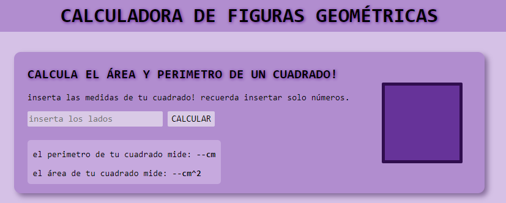
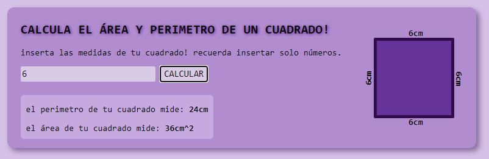

# Ejercicios-Java-script

## Ejercicio #1:  Calculadora de figuras geométricas

### Descripción:
Calculadora básica de figuras geométricas aplicando formulas en funciones de js y estructurando el contenido con html y css.

Se puede calcular distintas medias tanto en cuadrados, triangulos y circulos.

Adicionalmente en otra carpeta hay un calculador mucho mas sencillo (solo en consola) de la altura de un triangulo isoceles, asi como equilatero.
***